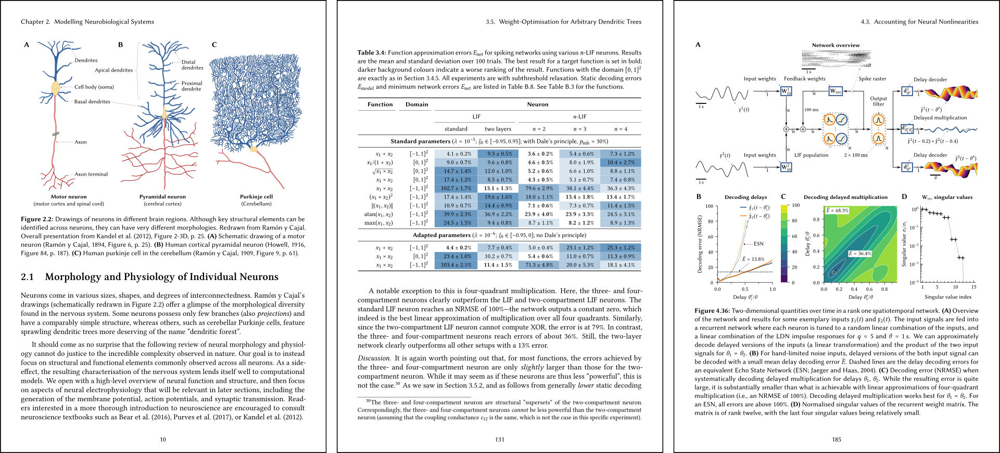

# Harnessing Neural Dynamics as a Computational Resource
**PhD Thesis, Andreas Stöckel, 2022, University of Waterloo**



The official version of this thesis can be downloaded from the University of Waterloo library:  
* 🎓 **Official download:** [`http://hdl.handle.net/10012/17850`](http://hdl.handle.net/10012/17850)

Unofficial, but potentially more up-to-date versions of the document are provided in the `pdfs/` folder on GitHub:
* 🌎 **US letter paper:** [`pdfs/astoeckel_phd_thesis_2021.pdf`](pdfs/astoeckel_phd_thesis_2021.pdf)
* 🌍 **A4 paper:** [`pdfs/astoeckel_phd_thesis_2021_a4.pdf`](pdfs/astoeckel_phd_thesis_2021_a4.pdf)

Experiment data, as well as VM and docker container images are hosted by the Open Science Foundation (OSF):

* 📌 **OSF project page** [`https://osf.io/y64xu/`](https://osf.io/y64xu/)
* 📌 **GitHub repository** [`https://github.com/astoeckel/phd_thesis`](https://github.com/astoeckel/phd_thesis)

```
@phdthesis{stoeckel2022,
    title={Harnessing Neural Dynamics as a Computational Resource},
    author={St\"ockel, Andreas},
    type={PhD Thesis},
    school={University of Waterloo},
    address={Waterloo, ON},
    year={2022},
    publisher="UWSpace",
    url={http://hdl.handle.net/10012/17850},
}
```

Note that the thesis defense was December 2021.
Due to the winter holidays, the final version of the thesis was only made available online in January 2022.
Correspondingly, the thesis lists “2021” as a year, but the University (and the above BibTeX entry) use “2022”.

## Abstract

Researchers study nervous systems at levels of scale spanning several orders of magnitude, both in terms of time and space.
While some parts of the brain are well understood at specific levels of description, there are few overarching theories that systematically bridge low-level mechanism and high-level function.
The Neural Engineering Framework (NEF) is an attempt at providing such a theory.
The NEF enables researchers to systematically map dynamical systems‒corresponding to some hypothesised brain function‒onto biologically constrained spiking neural networks.
In this thesis, we present several extensions to the NEF that broaden both the range of neural resources that can be harnessed for spatiotemporal computation and the range of available biological constraints.
Specifically, we suggest a method for harnessing the dynamics inherent in passive dendritic trees for computation, allowing us to construct single-layer spiking neural networks that, for some functions, achieve substantially lower errors than larger multi-layer networks.
Furthermore, we suggest “temporal tuning” as a unifying approach to harnessing temporal resources for computation through time.
This allows modellers to directly constrain networks to temporal tuning observed in nature, in ways not previously well-supported by the NEF.

We then explore specific examples of neurally plausible dynamics using these techniques.
In particular, we propose a new “information erasure” technique for constructing LTI systems generating temporal bases.
Such LTI systems can be used to establish an optimal basis for spatiotemporal computation.
We demonstrate how this captures “time cells” that have been observed throughout the brain.
As well, we demonstrate the viability of our extensions by constructing an adaptive filter model of the cerebellum that successfully reproduces key features of eyeblink conditioning observed in neurobiological experiments.

Outside the cognitive sciences, our work can help exploit resources available on existing neuromorphic computers, and inform future neuromorphic hardware design.
In machine learning, our spatiotemporal NEF populations map cleanly onto the Legendre Memory Unit (LMU), a promising artificial neural network architecture for stream-to-stream processing that outperforms competing approaches.
We find that one of our LTI systems derived through “information erasure” may serve as a computationally less expensive alternative to the LTI system commonly used in the LMU.


## Reproducing the Thesis

### 💻 Virtual Machine (VM) Image

To build the PDF and to execute the experiments, download the Fedora 33 VM image from OSF:

https://osf.io/qdxyf/

This image is in the `qcow2` format and compatible with a standard x86_64 KVM/QEMU VM (for example, use `virt-manager` or *Gnome Boxes* do create a new VM).

The username and password are:
```
thesis_user
HTVwkwbxdBdcc4B
```

Note that the VM has `sshd` enabled, so you can log in via SSH and use `sshfs` or `sftp` to transfer files.

Within the VM, execute the `download_thesis_and_data.sh`.
This will download the experiment data from OSF, this repository from GitHub, and attempts to build the thesis PDF.
This will re-generate all figures and requires some time (about 15-60 minutes depending on your machine) and a copious amount of RAM.

### 💡 Running the Experiments

If you wish to do so, you can also re-run all experiments within the VM.

All longer-runing experiments are executed within a Docker container and linked to a specific revision of this repository.
The experiments and generated files are listed under `code/Manifest.toml`.

Executing the experiments requires Linux with Python and a working Docker installation (provided in the VM), as well as a computer with at least 16 CPU cores (32 with hyperthreading) and 128 GB of RAM.

If you have downloaded the experiment data from OSF in the previous step, make sure to delete the `data/generated` folder.

Then, simply run
```
./scripts/run_experiments.py
```
to re-run all experiments. This will take several weeks.

Use the `--help` argument to obtain list of available commands; use `--list` to list all experiments and their build status.

## License

* **Thesis Document (PDF and LaTeX code)**  
The thesis *as a whole* is licensed under the [Creative Commons Attribution-NoDerivatives 4.0 International license](http://creativecommons.org/licenses/by-nd/4.0/). You may copy and distribute the thesis as it is, but you are not allowed to redistribute derivate works without explicit permission.

* **Figures**  
All *figures and illustrations* are licensed under the [Creative Commons  Attribution 4.0 International](http://creativecommons.org/licenses/by/4.0/) license.
You may copy, modify, and redistribute these figures, as long as you clearly reference this thesis as a source.

* **Software Source Code**  
Unless stated otherwise, all software included in this repository is licensed under the [GNU General Public License (GPL), version 3.0 or later](https://www.gnu.org/licenses/gpl-3.0.html).

## Patent notice

Parts of this work related to the Legendre Delay Network, Legendre Memory Unit, or feed-forward Legendre Memory Unit are protected by copyright, patents and/or provisional patents owned by Applied Brain Research Inc. (ABR; see https://appliedbrainresearch.com/). Relevant patents include, but are not limited to:

EP3796229A1, US11238337B2, CA2939561A1:  
"Methods and systems for implementing dynamic neural networks"

US20210342668A1:  
"Methods And Systems For Efficient Processing Of Recurrent Neural Networks"

US11238345B2:  
"Legendre memory units in recurrent neural networks"

63/313,676:  
“Efficient Linear Systems for Neural Network Applications”

The author of this repository (Andreas Stöckel) believes that the code in this repository only implements individual components, but not the complete systems described in these patents.

Still, any non-exclusive patent rights potentially issued through the license of this repository do not apply to patents owned by ABR, even if the author may be listed as an inventor or co-inventor in current or future patents owned by ABR.

Note that ABR grants a non-exclusive license to these patents for non-commercial or academic use. You can obtain a free license, or buy a license for commercial use at the following URL: https://appliedbrainresearch.com/store/
